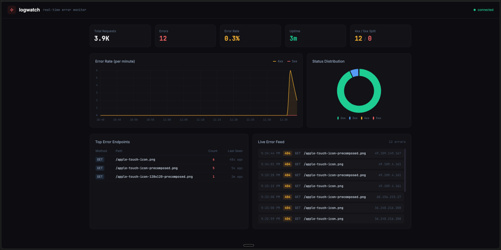

# Vigil

A simple, real-time error monitoring dashboard for HTTP server logs. Point it at an Apache/Nginx log file and instantly see 4xx/5xx errors as they happen.

Built with Bun and TypeScript. Zero production dependencies.



## Usage

```bash
bun install

# watch a log file
bun run src/index.ts --file /var/log/nginx/access.log

# or pipe from stdin
tail -f /var/log/apache2/access.log | bun run src/index.ts

# custom port
bun run src/index.ts --file /var/log/access.log --port 8080
```

Then open `http://localhost:7890`.

## CLI options

| Flag | Description | Default |
|------|-------------|---------|
| `-f, --file <path>` | Log file to watch | stdin |
| `-p, --port <number>` | Dashboard server port | `7890` |

## Why Vigil?

There are plenty of mature log analytics and monitoring tools out there — [GoAccess](https://goaccess.io/), [Grafana](https://grafana.com/) + Loki, the ELK stack, [Datadog](https://www.datadoghq.com/), and many more. Vigil is not trying to compete with or replace any of them.

This is a deliberately simple tool built to do one thing: point it at a log file, and instantly see HTTP errors in real time. No config files, no databases, no agents, no setup — just `bun run` and go. If you need advanced querying, long-term storage, or enterprise-grade observability, use the right tool for the job. If you just want a quick glance at what's going wrong on your server right now, that's what Vigil is for.
